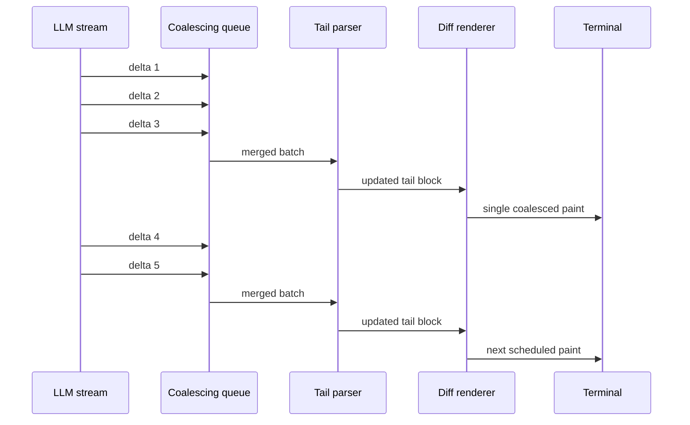

# Performant Terminal Rendering for LLM Markdown Streams in Coding Agents

## Executive summary

Terminal-native coding agents are now a real systems category, not just a UI variant. Recent benchmark and systems papers describe the terminal as the operational center of software work, emphasize that terminal tasks are long-horizon and interactive, and show that frontier agents still struggle on realistic CLI workloads. For rendering, that means the UI cannot be treated as a cosmetic layer: it is part of the agent’s control loop, and poor rendering decisions directly damage responsiveness, readability, and operator trust. citeturn33view2turn34search1turn33view1turn33view0

The strongest architectural conclusion is that fast terminal streaming comes from **three layers working together**: a transport that emits usable incremental events, a Markdown pipeline that avoids reparsing finalized content, and a renderer that writes only minimal terminal deltas. For append-only LLM output, reparsing the whole document on every token is usually the first major mistake. The best practical baseline is to buffer incoming deltas, coalesce them to a paint cadence, reparse only the mutable tail block, maintain offscreen state, and emit a diff that is aware of lines, regions, and terminal control sequences. This approach is directly supported by official terminal libraries and by recent engineering work on streaming Markdown in terminal UIs. citeturn21view14turn21view15turn25view3turn21view2turn26view0turn35view2

If no language is preselected, the best default choices are different by product shape. For a Python coding agent, `urlTextualturn6search5` is the best fit for a sophisticated full-screen app, while `urlprompt_toolkitturn5search13` is the best fit when editor-like input handling is the hardest problem. For Rust, `urlRatatuiturn31view3` plus `urlcrosstermturn31view0` is the clearest performance-oriented baseline. For Node, `urlInkturn5search2` is productive for local CLI apps, `urlblessedturn17search0` remains useful for low-level damage-aware control despite age, and `urlxterm.jsturn27search15` is the right choice when the terminal must also exist in a browser. Archived or effectively unmaintained stacks such as `urltui-rsturn32search0` and `urltermbox-goturn18search1` should not be starting points for a new coding agent. citeturn30search9turn26view0turn31view3turn31view0turn31view4turn17search0turn27search15turn32search2turn18search1

The practical recommendation is to ship in stages. First, establish a reproducible replay harness and latency metrics. Second, implement append buffering plus tail-only Markdown parsing. Third, add a viewport-scoped offscreen buffer and minimal diff writer. Fourth, harden backpressure, resizing, Unicode width handling, and non-interactive fallbacks. Only after that should you optimize fancy features like rich table streaming, inline code highlighting during partial fences, or dual local-and-web terminals. That ordering matches what the library docs, terminal standards, and recent agent papers all imply: correctness and responsiveness beat visual sophistication in the early phases. citeturn29view2turn29view3turn29view4turn35view3turn33view1turn33view0

## Operating context for coding agents

The recent papers on terminal-native agents converge on a specific environment model. A coding agent in the terminal is expected to inspect repositories, run builds, invoke shells and tools, operate over long sessions, and stay safe while handling arbitrary commands. `urlTerminal-Benchturn34search2` defines this environment explicitly with containerized tasks, instructions, tests, and reference solutions. `urlLongCLI-Benchturn34search1` argues that realistic command-line engineering is long-horizon and that current agents still underperform badly on such tasks. `urlBuilding AI Coding Agents for the Terminalturn33view1` turns that into engineering requirements: context management, safety controls, and extensibility. citeturn33view2turn34search1turn33view1

That context changes the rendering problem. The renderer is not just showing chat text. It must handle mixed content such as prose, shell transcripts, code fences, tables, approval prompts, logs, progress states, tool output, resize events, and often alternate-screen or inline modes. It must also avoid becoming the new bottleneck in a system that is frequently API-latency-bound rather than CPU-bound. The `urlCodex CLI migration paperturn33view0` makes this point directly: for an API-latency-bound coding agent, Python’s expressiveness advantages outweighed Rust’s raw performance, and the Python port still remained close to the Rust version on Terminal-Bench; that paper also states that the Python port’s presentation layer used the Textual framework. citeturn33view0

From those sources, the rendering goals for a coding agent are straightforward:

| Goal | Why it matters for coding agents | Starting engineering target |
|---|---|---|
| Fast first visible response | Users need immediate acknowledgment that the agent is alive and streaming | Show something within ~100 ms of an actionable UI event; if work exceeds ~50 ms, show feedback immediately |
| Stable continuous updates | Token streams can arrive much faster than a human needs to see every intermediate state | Paint at a controlled cadence, typically 30–60 Hz rather than on every token |
| Minimal output bytes | SSH, remote shells, browser terminals, and older terminals amplify write cost | Prefer deltas over full redraws; avoid writing unchanged cells |
| Bounded memory | Long sessions can accumulate huge scrollback and large Markdown/code blocks | Keep viewport state hot, scrollback cold, and reparsed tail small |
| Cross-terminal correctness | Terminal behavior varies across xterm-like emulators, Windows console hosts, and browser emulators | Stay near VT100/xterm-compatible sequences, use terminfo where appropriate, and explicitly enable Windows VT processing |
| Graceful degradation | Many coding agents also run non-interactively in CI or with piped stdout | Detect non-interactive mode and fall back to simpler final-frame output |

These targets are not literature averages. They are good starting SLOs derived from general interaction budgets and from how terminal libraries themselves structure rendering and scheduling. The RAIL model recommends visible response within 100 ms and work chunks under 50 ms, while xterm.js exposes a parsed-write event that fires at most once per frame, reinforcing the importance of frame-based coalescing instead of token-based repainting. citeturn14search1turn29view5

Cross-platform compatibility is not optional. On Unix-like systems, capability databases such as `urlterminfoturn8search1` are the classic abstraction for screen operations, padding, and initialization sequences. On Windows, the console host only interprets VT-style output when virtual-terminal processing is enabled, and the official documentation recommends writing full escape sequences in one call when possible. The more your renderer depends on emulator quirks rather than well-supported control sequences, the more fragile it becomes in real user environments. citeturn35view0turn21view9

## Streaming transport and Markdown pipeline

### Transport patterns

A streaming renderer should assume that transport semantics and rendering semantics are different layers. `urlSSE specturn10search2` defines a simple server-to-client event stream over HTTP. `urlWebSocket RFC 6455turn10search3` defines full-duplex framed messaging over a single TCP connection. `urlHTTP/1.1 chunked transfer codingturn13search0` exists specifically so content of unknown size can be sent as a series of chunks. `urlHTTP/2 RFC 9113turn12search3` adds streams and multiplexing. And `urlgRPC core conceptsturn12search1` formalizes ordered server-streaming and bidirectional streaming RPCs, with `urlgRPC flow controlturn12search0` explicitly calling out receiver protection and backpressure. citeturn10search2turn10search3turn21view17turn12search3turn12search1turn21view16

For LLM output specifically, provider documentation shows a strong move toward typed incremental events rather than opaque text blobs. `urlOpenAI streaming docsturn10search0` say the Responses API uses semantic streaming events with predefined schemas. `urlAnthropic streaming docsturn11search0` say setting `stream: true` yields SSE, and their versioning docs explicitly note the shift to incremental completions and named events rather than cumulative strings. For a terminal renderer, this means the app should keep transport-level event types intact until they are normalized into render events such as “append visible text”, “start tool output”, “close code fence”, or “replace status footer”. citeturn21view14turn21view15turn22view4

The transport choice should be driven by control-plane needs more than raw rendering theory.

| Transport | Best use | Strengths | Render-layer caution |
|---|---|---|---|
| SSE | One-way model output to a local or remote client | Simple, HTTP-friendly, widely used by LLM APIs | You still need your own coalescing and reconnection semantics |
| HTTP chunked response | Minimalist server-to-client streaming | Very low conceptual overhead | Event typing is up to you; intermediaries can behave differently |
| WebSocket | Browser terminal, bidirectional control, tool approvals, live cursor state | Full duplex, single connection | No built-in hooks for end-to-end flow control over buffered websocket legs |
| HTTP/2 stream | Many multiplexed streams from one connection | Native stream multiplexing | More complexity than most local CLIs need |
| gRPC streaming | Typed multi-service backends, infra-heavy deployments | Ordering guarantees per RPC and built-in flow control model | Usually overkill for a local single-process CLI |

That comparison is a synthesis of the standards, provider docs, and xterm.js operational guidance. In particular, xterm.js’s own flow-control guide warns that when a websocket sits between backend and terminal, its buffers are effectively uncontrolled from the application’s point of view, so application-level acknowledgment or pacing becomes necessary. citeturn10search2turn21view17turn12search3turn12search1turn21view16turn21view7

### Incremental Markdown parsing

Markdown is much harder to stream than plain text because block identity can change after more text arrives. The `urlCommonMark specturn4search0` exists precisely because Markdown needs a rigorous syntax definition and conformance tests. But the spec does not by itself tell you how to stream-render efficiently. For that, the most useful principle comes from Will McGugan’s 2025 write-up, `urlEfficient streaming of Markdown in the terminalturn24search7`: in append-only document growth, earlier top-level blocks are usually finalized, and only the last block remains mutable — with the important caveat that the last block may still change type, such as a paragraph becoming a table when the full table syntax has arrived. citeturn22view2turn25view3

The parser/tooling landscape breaks into four practical families. `urlmicromarkturn19search0` is a state-machine Markdown parser that emits concrete tokens with positional information. `urlpulldown-cmarkturn19search2` is a pull parser whose `Parser` yields an iterator of events. `urlremark-parseturn4search19` turns Markdown into a syntax tree in the unified/remark ecosystem and is excellent when you need AST transforms, but a maintainer note says remark itself does not support real stream parsing because streaming has overhead for ASTs. `urlTree-sitterturn23view0` and `urlLezerturn24search12` are incremental, error-tolerant parser systems built for editing scenarios, and `urlLezer Markdownturn24search0` specifically exposes an incremental Markdown parser that reuses fragments of prior trees. citeturn21view11turn21view12turn22view3turn19search12turn23view0turn25view1turn25view0

The strategic implication is simple: **append-only streaming output should start with block-finalization, not a fully general incremental AST**. A full incremental tree becomes worth it when the user is editing arbitrary earlier regions, when you need structural queries over partially complete content, or when you want syntax-aware mixed-language subtrees inside Markdown. But if your stream is primarily “LLM tokens appended to the end”, a block-aware tail parser is usually cheaper, simpler, and more predictable. McGugan reports that after switching to reparsing only from the start line of the last block, parsing cost became sub-1 ms regardless of total document size in Textual’s streaming Markdown path. citeturn25view3

The best practical parsing strategies compare like this:

| Strategy | Complexity | Strengths | Weaknesses | Best fit |
|---|---|---|---|---|
| Full document reparse per update | Lowest implementation effort | Easy correctness story | Scales poorly as document grows | Prototype only |
| Tail-only block reparse | Low to moderate | Excellent for append-only streams; handles block finalization naturally | Needs special care for block-type flips and fence termination | Default choice for coding-agent output |
| Event/pull parser pipeline | Moderate | Good for direct render pipelines without mutable AST overhead | Harder for rich post-hoc transforms | Rust/C-oriented efficient renderers |
| Incremental CST/AST | High | Excellent for editor-like features, arbitrary edits, tolerant parse recovery | More state, more implementation complexity | Interactive Markdown editors or mixed editing/viewing agents |

This table synthesizes the CommonMark spec, the docs for micromark/pulldown-cmark/remark, Tree-sitter and Lezer, and McGugan’s 2025 streaming design notes. citeturn22view2turn21view11turn21view12turn22view3turn23view0turn25view1turn25view0turn25view3

A robust streaming Markdown pipeline for coding agents should therefore use these rules. Keep a raw append buffer. Maintain block boundaries and the start offset of the mutable tail block. Reparse only that tail block on each coalesced update. Cache finalized block render objects. Permit the tail block to change type until it becomes final. Treat unterminated code fences, tables, and lists as expected partial states rather than parse failures. If syntax highlighting is expensive, delay full highlighting until the fence closes or highlight visible lines only. That is consistent with the tolerant-parsing goals documented by Tree-sitter and Lezer, and with the block-finalization approach shown in recent Textual engineering. citeturn23view0turn25view1turn25view0turn25view3

## Terminal rendering algorithms and data structures

### Minimal-update algorithms

The core rendering lesson from classic terminal systems has not changed. Maintain a virtual or offscreen representation, compare it with the prior frame, and write only what changed. In X/Open curses, `wnoutrefresh()` collects virtual-screen changes and `doupdate()` sends the terminal commands needed to update the physical display. prompt_toolkit says its renderer calculates the difference between the last output and the new one and is heavily optimized to reduce stdout writes. Ratatui says it uses double buffering and a diff between current and previous buffers before flushing to the terminal. notcurses renders a virtual pile to a cell matrix and then rasterizes that to optimized control sequences and graphemes for the terminal. citeturn9search5turn26view0turn26view3turn21view2turn35view2

That means a modern coding-agent renderer should be organized around **logical blocks and physical cells at the same time**. Logical blocks are the right unit for Markdown semantics and parser invalidation. Physical cells are the right unit for terminal I/O minimization. The best compromise is usually a block-aware dirty tracker feeding a cell-grid diff writer. For normal paragraph growth, you dirty only the last block. For code-fence growth, you dirty the last visible lines of that fence. For scrolling, you attempt scroll-region or insert/delete-line operations before falling back to cell-level rediffing. For theme changes or resize, you allow a broader redraw. This synthesis matches the behavior and abstractions in curses, prompt_toolkit, Ratatui, blessed, and notcurses. citeturn9search5turn26view0turn21view2turn17search0turn35view2

The terminal-control layer should stay conservative. `urlECMA-48turn8search3` is the historical control-sequence standard. `urlxterm control sequencesturn9search0` documents the de facto superset most emulators imitate, and notes that xterm itself decodes sequences with a state machine and resets to a ground state on malformed input. `urlWindows console VT sequencesturn21view9` says Windows behavior is based on VT100/xterm-derived technologies and requires virtual-terminal mode to be enabled. `urlterminfoturn8search1` remains the capability database for how to perform screen operations on a given terminal. In other words, emit the smallest useful subset of cursor motion, erase, style, insert/delete/scroll controls, and do not assume every emulator implements every xterm extension identically. citeturn8search3turn21view8turn21view9turn35view0

One subtle but important failure mode is Unicode width ambiguity. notcurses exposes an `hpa_gratuitous` metric specifically because it is often impossible to know exactly how wide a glyph sequence will render under a particular terminal, font, and font renderer combination. That matters in Markdown streaming because code blocks, tables, and inline formatting all rely on stable cursor placement. Any renderer that works on byte counts or code points rather than display cells will eventually drift. citeturn35view3

### Buffering, virtualization, and windowing

The offscreen model is well established across libraries. prompt_toolkit paints into a `Screen` object before rendering to stdout. Ratatui explicitly describes an intermediate buffer and double-buffer swap. notcurses separates plane rendering from rasterization and can even render to a buffer before writing to the terminal. That common design suggests a clean architecture for coding agents: keep a full logical document model, but only materialize a viewport-oriented physical buffer for the hot path. citeturn26view0turn26view3turn21view2turn35view2

Viewport virtualization is particularly important once long sessions accumulate thousands of lines. xterm.js exposes terminal row counts, rendered row ranges via `onRender`, and a parsed-write event that fires at most once per frame. Those APIs reflect the right mental model even for native terminals: treat visible rows, plus perhaps one or two screens of overscan, as the working set. Keep scrollback in a cheaper backing representation such as plain text plus block metadata, and reconstruct styled cells only when lines enter the viewport. That greatly lowers memory pressure and avoids repeatedly diffing cells the user cannot see. citeturn29view5

There is also a product decision around the alternate screen. Rich Live can render in an alternate screen and restore the shell on exit. Ratatui backends explicitly support alternate screen and raw mode. Ink documents that alternate screen is only for interactive mode and that scrollback is unavailable while it is active. For coding agents, alternate screen is best when the app behaves like a modal full-screen tool. If users rely on native shell scrollback to review the conversation and tool outputs later, inline rendering is often the better choice. citeturn21view5turn31view1turn31view4

```mermaid
flowchart LR
    A[LLM transport events] --> B[Coalescing buffer]
    B --> C[Append-only raw markdown buffer]
    C --> D[Tail block parser]
    D --> E[Block finalizer and block cache]
    E --> F[Viewport materializer]
    F --> G[Offscreen cell buffer]
    G --> H[Diff and ANSI/VT encoder]
    H --> I[Terminal write scheduler]
    I --> J[TTY or browser terminal]
```



That data flow is the recommended baseline because it isolates the most variable parts of the system. The transport can change from SSE to WebSocket or gRPC without changing the parser. The parser can change from a block parser to an incremental tree without changing the diff writer. And the output writer can target a native TTY, Windows console host, or browser terminal while preserving the same logical document pipeline. citeturn10search2turn10search3turn12search1turn25view3turn21view2turn21view9turn29view5

## Library landscape

The matrix below synthesizes the official docs and repository status for the requested libraries plus one additional native option, `urlnotcursesturn16search19`, because it exposes unusually useful render metrics and a strong virtual-scene model. citeturn21view5turn21view3turn26view0turn31view3turn31view0turn31view4turn17search0turn27search15turn32search2turn18search1turn35view2

| Stack | Rendering model | Strongest fit | Important cautions |
|---|---|---|---|
| `urlRichturn5search6` | Retained renderables with live refresh | Simple to moderate Python CLIs, rich text/Markdown, status regions | Live display defaults to 4 refreshes/sec; for token streams you generally want manual refresh and coalescing rather than repainting each token |
| `urlTextualturn6search5` | Retained widgets, reactive updates, async workers | Full-screen Python coding agent with panes, status, controls, logs | Rich feature set means more retained-mode overhead than a minimal immediate renderer; use workers for tasks that can take more than a few ms |
| `urlprompt_toolkitturn5search13` | Screen canvas plus optimized diff | Editor-like input, shell UX, powerful line editing, Python full-screen apps | Better when input/editor behavior is central; less opinionated for complex document widgets than Textual |
| `urlInkturn5search2` | React renderer for terminal UI | Productive Node local CLIs, especially if your team already thinks in React | Alternate screen drops scrollback; non-interactive mode skips cursor/erase/resize behaviors and only writes the final frame for non-static output |
| `urlblessedturn17search0` | DOM-like widgets with damage buffer and CSR optimizations | Low-level Node TUI work where explicit terminal control matters | The project is old, and `smartCSR` is documented as potentially flickery for some non-full-width elements |
| `urlxterm.jsturn27search15` | Browser terminal emulator | Web mirror of agent sessions, remote terminals, browser-native products | It is a frontend terminal, not a native local TTY library; websocket flow control needs application-level handling |
| `urlRatatuiturn31view3` + `urlcrosstermturn31view0` | Immediate mode + double-buffer diff | Rust local agents where predictable rendering cost matters most | You redraw the full logical frame every tick, so app structure must separate state updates from full-frame materialization |
| `urltui-rsturn32search0` | Legacy predecessor to modern Rust TUI stacks | Existing codebases only | Repository is archived and read-only |
| `urlncurses doupdate APIhttps://pubs.opengroup.org/onlinepubs/7908799/xcurses/doupdate.html` | Virtual screen + physical screen diff | C/C++ or systems code that needs classic portability patterns | Powerful but lower-level and less ergonomic for Markdown-rich agent UIs |
| `urltermbox-goturn18search1` / `urltermboxturn18search5` | Minimal cell buffer APIs | Very small TUIs or legacy maintenance | termbox-go says it is not maintained; the centralized C repo advises new projects to consider termbox2 |
| `urlnotcursesturn16search19` | Virtual plane graph + optimized rasterizer | Native high-performance TUIs with strong metrics and advanced rasterization | More native complexity than the higher-level stacks; best when you want explicit control over rasterization behavior |

Two points stand out from that matrix. First, the **Python split is real**: Rich is excellent for “single rich output region plus controls”, Textual is excellent for a true application shell, and prompt_toolkit is excellent when terminal input semantics are the hardest part. Second, the **Rust split is also real**: Ratatui plus Crossterm is the clearest high-control local-CLI path, while ncurses or notcurses are better when you are already operating in C/C++ or need direct control over capability-level behavior. citeturn21view5turn21view3turn21view4turn26view0turn26view3turn31view3turn31view0turn35view2

For a new coding agent, the most defensible stack choices are:

| Product shape | Best starting stack | Why |
|---|---|---|
| Python full-screen coding agent | `urlTextualturn6search5` | Reactive refresh coalescing, worker model, testing/story for headless and snapshot workflows, and evidence of production-agent use in recent systems work |
| Python shell-first assistant with superior input UX | `urlprompt_toolkitturn5search13` | Strongest documented diffing/input model and a direct testing story |
| Rust local CLI with tight repaint control | `urlRatatuiturn31view3` + `urlcrosstermturn31view0` | Double buffering, diffing, alternate screen/raw mode, and cross-platform terminal control |
| Node local CLI | `urlInkturn5search2` | Fastest productivity path if React mental models dominate |
| Browser-hosted terminal | `urlxterm.jsturn27search15` | Purpose-built terminal emulator with render and parse lifecycle hooks |
| Native C/C++/systems path | `urlnotcursesturn16search19` or `urlncurses doupdate APIhttps://pubs.opengroup.org/onlinepubs/7908799/xcurses/doupdate.html` | Capability-aware virtual scene models and mature low-level control |

That recommendation set follows the official docs, current maintenance status, and the kinds of architectural needs surfaced in the recent coding-agent papers. citeturn33view0turn21view3turn29view2turn26view0turn31view3turn31view0turn31view4turn29view5turn18search1turn32search2

## Benchmarking and testing

### Metrics that actually matter

The most useful rendering metrics are not generic “FPS” numbers. For a coding agent, you want metrics that separate **transport**, **parse**, **diff**, **write**, and **perceived response**. notcurses is unusually explicit here: it exposes render time, raster time, writeout time, bytes emitted, maximum/minimum raster bytes per frame, cell emissions versus elisions, refresh count, input errors, and framebuffer memory. Even if you do not use notcurses, that metrics schema is a strong model for what your own harness should record. citeturn35view3

A good benchmark suite should collect these dimensions:

| Metric | What it tells you | How to instrument |
|---|---|---|
| First visible response | Whether the user gets prompt acknowledgment | Timestamp event arrival to first paint or first terminal write |
| Token-to-screen latency | Actual streaming responsiveness | Per coalesced batch: last token arrival to paint completion |
| Parse time | Whether Markdown handling is the bottleneck | Time the tail-parser or incremental parse step separately |
| Diff/encode time | Cost of transforming logical state to terminal bytes | Time buffer diff and ANSI/VT serialization |
| Write time and bytes/frame | Whether terminal I/O is the bottleneck | Count bytes, write calls, and total write duration |
| Dirty rows / dirty cells | Whether your invalidation strategy is too broad | Record changed viewport rows and changed cells |
| Dropped/coalesced updates | Whether batching is working | Count token batches merged before paint |
| CPU and RSS | Whether the renderer scales over long sessions | Use process metrics and platform profilers |
| Flicker / visual instability | Whether minimal updates are semantically correct | Golden-frame comparison plus manual visual review on resize, scroll, and block-type flips |
| Cursor drift / Unicode correctness | Whether width calculations stay aligned | Dedicated wide-glyph and combining-mark test corpus |

That mix is justified by a combination of official testing docs, terminal render instrumentation, and general UI responsiveness guidance. prompt_toolkit, Textual, Ink, and Ratatui all provide good testing hooks for headless frame capture or screen-level verification, and the RAIL model gives a useful interaction-level budget vocabulary. citeturn29view3turn29view1turn29view2turn29view4turn31view1turn14search1turn35view3

### Reproducible benchmark scenarios

A renderer benchmark that only replays plain paragraphs will miss the hard cases. The minimum useful workload matrix should include block-type mutation, long code fences, scroll-heavy logs, viewport resize, and Unicode-width stress. It should also replay both fast local token traces and artificially “bursty” traces where many tokens arrive before one paint cycle, because those are exactly the conditions that expose coalescing and backpressure flaws. McGugan’s write-up is especially relevant here because it explicitly calls out block-type transitions and token rates high enough that repainting every intermediate state becomes counterproductive. citeturn25view3

A practical microbenchmark set should include:

| Scenario | What it stresses | Good target budget |
|---|---|---|
| Grow a paragraph by 1–8 tokens per batch | Tail append path | Tail parse + diff well below one frame budget |
| Grow an open code fence | Partial fence rendering and optional syntax highlight deferral | No full-document reparse; stable line wrapping |
| Convert a paragraph tail into a table | Block-type flip handling | Correct block replacement without visible flicker |
| Stream 10k+ lines of shell/log output | Scrollback and viewport virtualization | CPU stays bounded; offscreen work remains viewport-scoped |
| Resize 80×24 to 160×48 and back | Full reflow, wrapping, layout invalidation | One obvious redraw, then fast steady-state again |
| Wide glyphs, emoji, combining marks, tabs | Cell-width correctness | No cursor drift or table misalignment |
| Slow-output mode | Write batching and minimal bytes | Total bytes/frame and write calls remain controlled |

The most defensible numeric goals are **budget targets**, not copied vendor benchmarks. A good initial bar is: visible acknowledgment within 100 ms, work chunks under 50 ms, paint cadence around 16–33 ms, and parser cost low enough that it does not consume a significant portion of those paint windows. McGugan reports sub-1 ms parsing after switching to a tail-only block parse, which is a good aspirational bound for the Markdown stage. xterm.js’s `onWriteParsed` firing at most once per frame is also a useful reminder that once your downstream terminal is frame-oriented, sending more paints than frames buys little. citeturn14search1turn25view3turn29view5

### Testing strategies

Testing should happen at three layers. At the **parser layer**, maintain a corpus of partial Markdown states and verify block identity transitions. At the **renderer layer**, verify buffer diffs and exact output bytes or cell grids. At the **end-to-end UI layer**, drive the app headlessly and compare frames or snapshots. Textual provides `run_test()` with headless execution plus a `Pilot` driver, and also documents snapshot testing using generated SVG screenshots. prompt_toolkit recommends pipe inputs and dummy outputs for unit tests. Ink’s testing library captures every rendered frame and allows stdin injection. Ratatui’s backend docs include a `TestBackend` for UI tests. citeturn29view1turn29view2turn29view3turn29view4turn31view1

The compatibility matrix should not be an afterthought. Run the same replay corpus across at least one xterm-like emulator, one modern GPU-accelerated emulator, a Windows console or Windows Terminal path with VT enabled, and a browser terminal if you support one. Include alternate-screen and inline modes. Include a no-TTY/piped-stdout mode. Include malformed or fragmented control-sequence inputs at the transport boundary. xterm’s own control-sequence documentation explicitly discusses state-machine error recovery, and Microsoft’s documentation explicitly documents Windows VT behavior as a configurable console mode rather than an automatic universal default. citeturn21view8turn21view9



That timeline is the key behavioral invariant: if the model can outproduce the renderer, the renderer should skip intermediate visual states rather than lagging seconds behind reality. McGugan’s 2025 write-up makes exactly that argument for streaming terminal Markdown. citeturn25view3

## Recommended architecture and implementation plan

The recommended architecture for a new coding-agent renderer is:

1. **Normalize transport events into render events.** Keep provider event schemas intact until they become UI-level operations such as append text, update status, or attach tool output. This lets you support SSE and WebSocket without rewriting the renderer core. citeturn21view14turn21view15turn10search2turn10search3  
2. **Maintain an append-only raw buffer plus tail-block metadata.** The mutable tail is the only part that should normally be reparsed for streamed model output. citeturn25view3turn22view2  
3. **Cache finalized blocks.** Paragraphs, code fences, tables, and list items that are no longer mutable should become immutable render blocks until resize or theme change forces rematerialization. citeturn25view3  
4. **Materialize only the viewport into cells.** Keep full-document structure logically, but only construct visible rows plus small overscan for the hot rendering path. citeturn29view5turn21view2turn26view0  
5. **Diff against the prior cell buffer and emit minimal control sequences.** Use line- and region-aware shortcuts for scroll and insertion before general cell diff. citeturn9search5turn21view2turn17search0turn35view2  
6. **Schedule paints, do not paint on every token.** Coalesce faster-than-frame-rate token bursts, and treat transport backpressure separately from terminal paint cadence. citeturn21view7turn21view16turn29view5turn25view3

### Python sketch

This sketch reflects the most practical Python design for a full-screen coding agent: async ingestion, coalescing, tail-only Markdown parsing, viewport materialization, and diff-based writes.

```python
# Pseudocode only

class StreamRenderer:
    def __init__(self, terminal, parser, scheduler):
        self.terminal = terminal
        self.parser = parser
        self.scheduler = scheduler
        self.raw = []
        self.blocks = []          # finalized + mutable tail
        self.tail_start = 0
        self.prev_cells = None
        self.pending = ""
        self.paint_scheduled = False

    async def on_llm_delta(self, text: str) -> None:
        self.pending += text
        if not self.paint_scheduled:
            self.paint_scheduled = True
            await self.scheduler.call_later_ms(16, self.flush_pending)

    async def flush_pending(self) -> None:
        chunk = self.pending
        self.pending = ""
        self.paint_scheduled = False

        self.raw.append(chunk)
        source = "".join(self.raw)

        tail_source = source[self.tail_start:]
        new_tail_blocks = self.parser.parse_tail(tail_source)

        self.blocks = self.blocks_before_tail() + new_tail_blocks
        self.tail_start = self.compute_tail_start(source, self.blocks)

        viewport = materialize_viewport(self.blocks, self.terminal.size)
        new_cells = rasterize_to_cells(viewport)

        diff = diff_cells(self.prev_cells, new_cells, terminal_caps=self.terminal.caps)
        await self.terminal.write(diff)

        self.prev_cells = new_cells

        if self.pending:
            await self.flush_pending()
```

The Python library mapping is straightforward: `urlTextualturn6search5` if the UI is app-like and multi-pane, `urlprompt_toolkitturn5search13` if input behavior dominates, and `urlRichturn5search6` if the app is primarily one rich output region plus simple controls. Textual’s reactivity and worker model, prompt_toolkit’s screen diffing, and Rich’s live rendering modes all support versions of this architecture. citeturn21view3turn21view4turn26view0turn26view3turn21view5

### Node sketch

For Node, the main branching decision is whether the terminal is local or browser-hosted. The local case can use Ink or blessed; the browser case should use xterm.js and explicit flow-control strategy over WebSocket.

```javascript
// Pseudocode only

class RenderLoop {
  constructor(term, parser) {
    this.term = term;
    this.parser = parser;
    this.pending = "";
    this.scheduled = false;
    this.prev = null;
    this.doc = "";
    this.tailStart = 0;
    this.blocks = [];
  }

  onDelta(delta) {
    this.pending += delta;
    if (!this.scheduled) {
      this.scheduled = true;
      setTimeout(() => this.flush(), 16);
    }
  }

  flush() {
    this.scheduled = false;
    const batch = this.pending;
    this.pending = "";

    this.doc += batch;
    const tail = this.doc.slice(this.tailStart);
    const tailBlocks = this.parser.parseTail(tail);
    this.blocks = finalizedPrefix(this.blocks).concat(tailBlocks);
    this.tailStart = recomputeTailStart(this.doc, this.blocks);

    const viewport = buildViewport(this.blocks, this.term.rows, this.term.cols);
    const next = cellBuffer(viewport);
    const ansi = diffToAnsi(this.prev, next);
    this.term.write(ansi);
    this.prev = next;

    if (this.pending.length) this.flush();
  }
}
```

`urlInkturn5search2` is best if you want a declarative app framework, but its docs are explicit that alternate-screen mode removes scrollback and non-interactive mode disables terminal-specific behaviors. `urlblessedturn17search0` gives more direct low-level terminal control, including CSR and damage buffering. `urlxterm.jsturn27search15` is the right renderer if the terminal lives in a browser; then you should match its documented lifecycle with application-level backpressure over the websocket boundary. citeturn31view4turn17search0turn21view7turn29view5

### Rust sketch

Rust is the cleanest place to express an immediate-mode full-frame loop with persistent logical state and diffed physical output.

```rust
// Pseudocode only

struct AppState {
    raw_doc: String,
    blocks: Vec<Block>,
    tail_start: usize,
    pending: String,
}

fn on_delta(state: &mut AppState, delta: &str) {
    state.pending.push_str(delta);
}

fn tick(state: &mut AppState, terminal: &mut Terminal<CrosstermBackend<std::io::Stdout>>) {
    if !state.pending.is_empty() {
        state.raw_doc.push_str(&state.pending);
        state.pending.clear();

        let tail = &state.raw_doc[state.tail_start..];
        let tail_blocks = parse_tail_markdown(tail);
        state.blocks = finalized_prefix(&state.blocks).into_iter()
            .chain(tail_blocks.into_iter())
            .collect();
        state.tail_start = recompute_tail_start(&state.raw_doc, &state.blocks);
    }

    terminal.draw(|frame| {
        let viewport = materialize_viewport(&state.blocks, frame.area());
        render_blocks_into_frame(frame, viewport);
    }).unwrap();
}
```

This matches Ratatui’s documented model closely: render the full logical frame every draw, let the library manage the double buffers, and let the backend diff flush only the changed cells. Crossterm then gives you explicit control over raw mode, alternate screen, cursor movement, and flush timing. citeturn21view2turn31view3turn31view0

### Tradeoffs and failure modes

The main design tradeoff is **retained mode versus immediate mode**. Retained-mode systems such as Textual and Ink are often faster to develop in because state changes map naturally onto widgets or components. Immediate-mode systems such as Ratatui make cost easier to reason about because every draw is explicit and the diffing boundary is sharp. For a coding agent, retained mode wins when the product has many interactive panes and controls. Immediate mode wins when the key problem is predictable high-rate redraw of a dense text surface. citeturn21view3turn31view3turn31view4

The most common failure modes are predictable. Full-document reparsing per token causes late-session slowdown. Per-token repainting causes event-queue lag even when the model has already produced later text. Overly broad dirty regions cause scroll flicker and huge write bursts. Incorrect Unicode width accounting causes cursor drift and broken tables. Alternate-screen mode can surprise users by hiding the shell’s scrollback. Non-interactive stdout paths can break if the renderer assumes terminal control is always available. And browser terminals are particularly vulnerable to hidden buffer buildup unless the app implements flow-aware pacing. citeturn25view3turn35view3turn31view4turn21view7

The recommended rollout is therefore incremental:

| Phase | Deliverable | Success criterion |
|---|---|---|
| Benchmark harness | Replay corpus, frame metrics, golden outputs | You can compare renderer changes reproducibly |
| Tail parser | Append buffer + block-finalized tail-only parsing | Long documents stay near-constant parse cost |
| Minimal diff writer | Offscreen cell buffer + delta emission | Bytes/frame and write calls drop sharply vs full redraw |
| Backpressure and coalescing | Frame scheduler and merge queue | UI never lags far behind produced output |
| Compatibility hardening | Width tests, resize tests, Windows VT, no-TTY mode | Same replay corpus passes on all target terminals |
| Advanced fidelity | Better code-block highlighting, table streaming, browser mirror | Improvements do not regress core latency budgets |

That implementation order is the most robust reading of the official terminal docs, the testing docs, and the recent engineering and systems papers: measure first, make the fast path append-only and viewport-scoped, then harden compatibility, then add polish. citeturn29view2turn29view3turn29view4turn35view3turn21view9turn33view1turn33view0

The final recommendation is concise. For a new coding agent, build the renderer around **coalesced streaming events, tail-only block parsing, cached finalized blocks, viewport materialization, and cell-level diff output**. Choose **Textual** or **prompt_toolkit** in Python, **Ratatui + Crossterm** in Rust, and **Ink** or **xterm.js** in Node depending on whether the terminal is local or browser-based. Avoid archived or unmaintained core stacks for greenfield work. And treat rendering as part of the agent runtime, not as a decorative afterthought. citeturn21view3turn26view0turn31view3turn31view0turn31view4turn29view5turn32search2turn18search1
